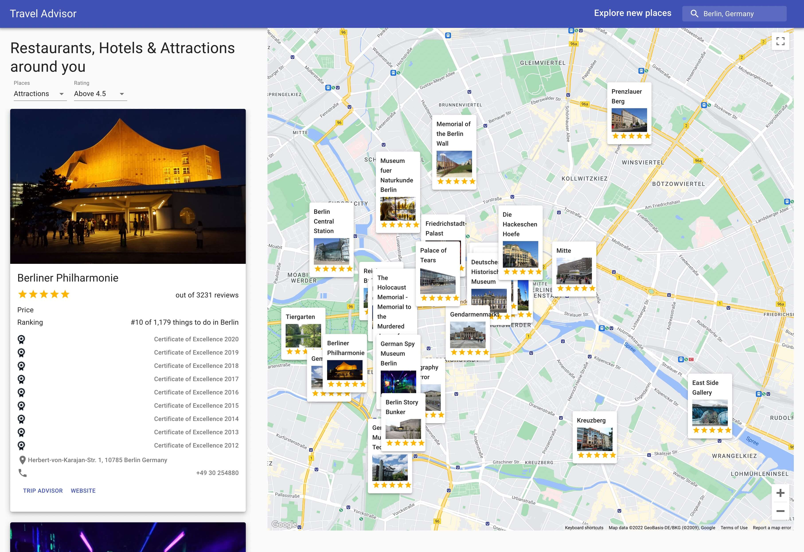

# Travel Advisor App

This is a front end only JAM Application pulling data from 2 sources: Googlemaps and Tripadvisor. It's a classical API mashup built with React where location bound Restaurants, Hotels, and Sights from Tripadvisor are layered upon a map in the form of hovering cards.

As one would expect from app of that sort it offers all the basic functionality such as rating and location filtering, location search with autocomplete, automatic retrieval of new locations on map repositioning etc.

The entire project is merely a proof of concept and a way to teach myself new skills, it makes no claims to be exhaustive or comprehensive. As unpolished as it is, it works well enough to make myself not go red in the face. Although, I've used material UI framework which you can customize to your heart's content the layout is a little too generic for my liking and a bit off here and there on desktop (minor issues with alignment) and even more so on mobile since the app has been written from the outset with an eye towards the desktop version.